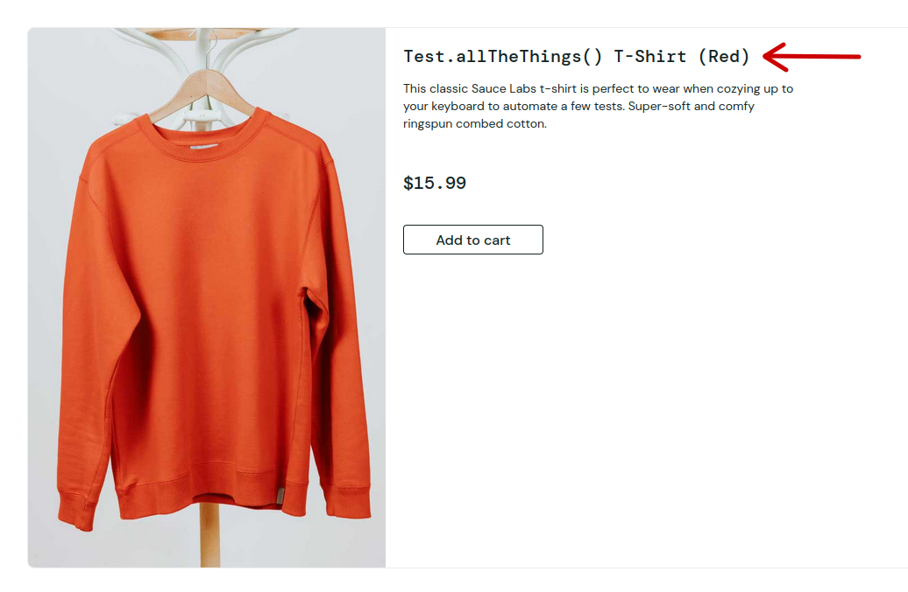

# BUG REPORT-UI:

### Subject:
`Sauce Labs T-Shirt` link is broken.

### Description:
The `Sauce Labs T-Shirt` item displays as `Test.allTheThings() T-Shirt (Red)` in the store.

### Steps to Reproduce:
1. Open `https://www.saucedemo.com` -> Login.
2. Note the red shirt in the bottom-right of the screen.

### Notice:
The shirt's name is showing incorrectly. Note, if the user selects the shirt link they're taken to the short's item details page correctly and the actual name is listed in the description. Screenshots attached below.

### Expected:
All items in the store front are displayed with the correct names.

